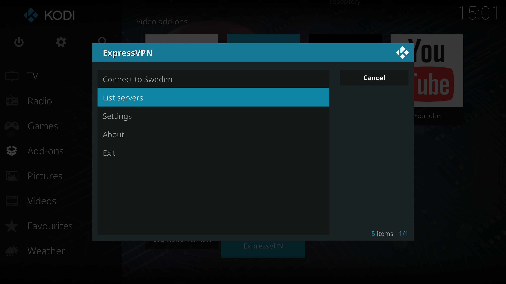

# Expressvpn-kodi-client

Unofficial addon for managing expressvpn from within kodi.

Features include:
i) Connect/disconnect to server
ii) Change expressvpn settings
iii) Store favourite servers

# Installation
i) 
