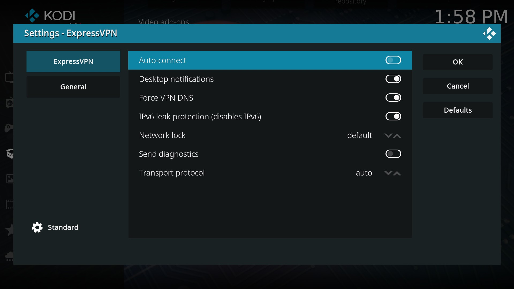

# ExpressVPN (Linux only)
Kodi add-on for managing ExpressVPN connections. The add-on provides a GUI for:

i) Connecting/disconnecting.

ii) List servers by continent

iii) Storing your favourite servers.

iv) Changing ExpressVPN settings.

You need a paid subscription for the add-on to work.

## Screenshots
<table>
  <tr>
    <td></td>
    <td></td>
    <td></td>
    <td></td>
  </tr>
 </table>

## Installation
Download repository as a zip file and follow these instructions: https://kodi.wiki/view/Archive:Install_add-ons_from_zip_files.

## Disclaimer
This add-on is unofficial and its author has no affiliation with https://expressvpn.com.

## Additional Notes
Use the Leia branch for Leia and earlier versions of Kodi and the Master branch for Matrix. The add-on has been tested to work for Krypton (17.6) and higher. I only aim at providing support for current releases of Kodi.
